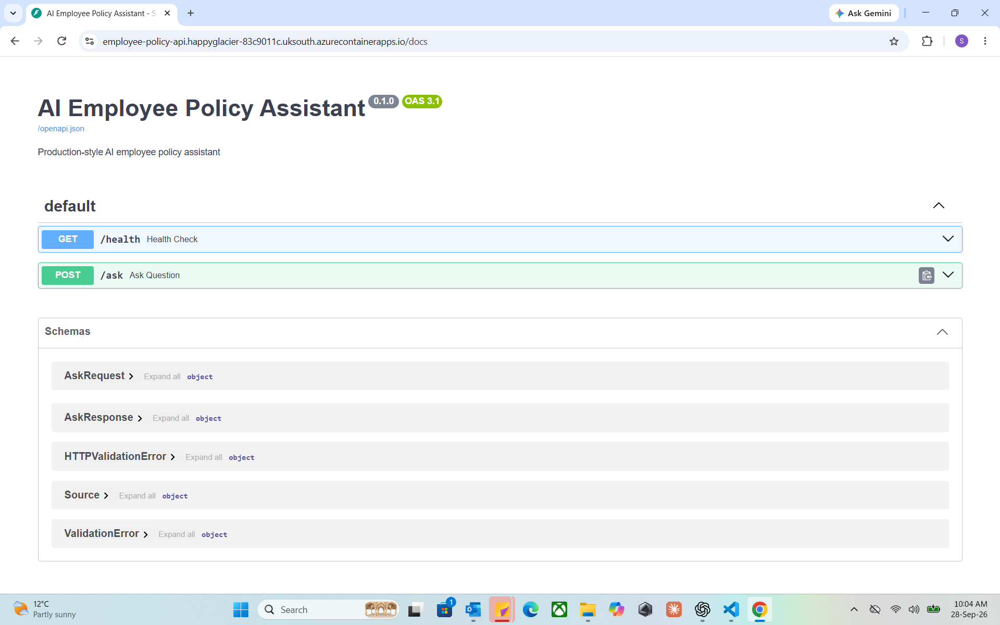
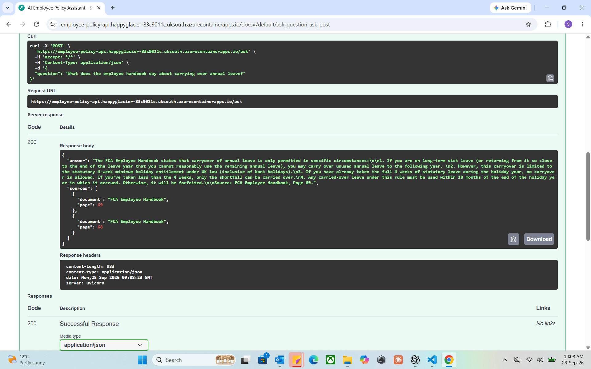
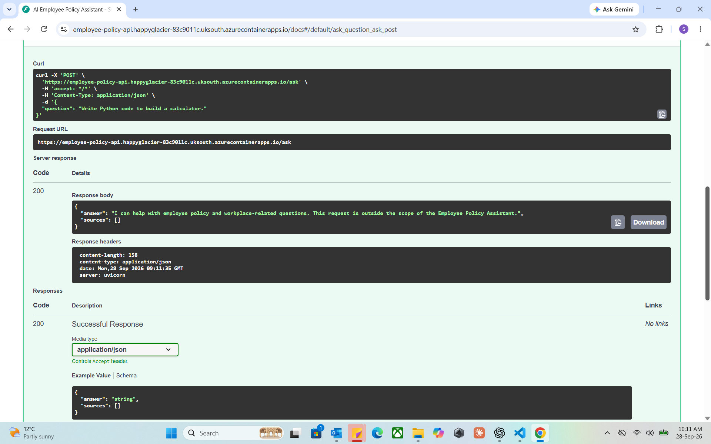
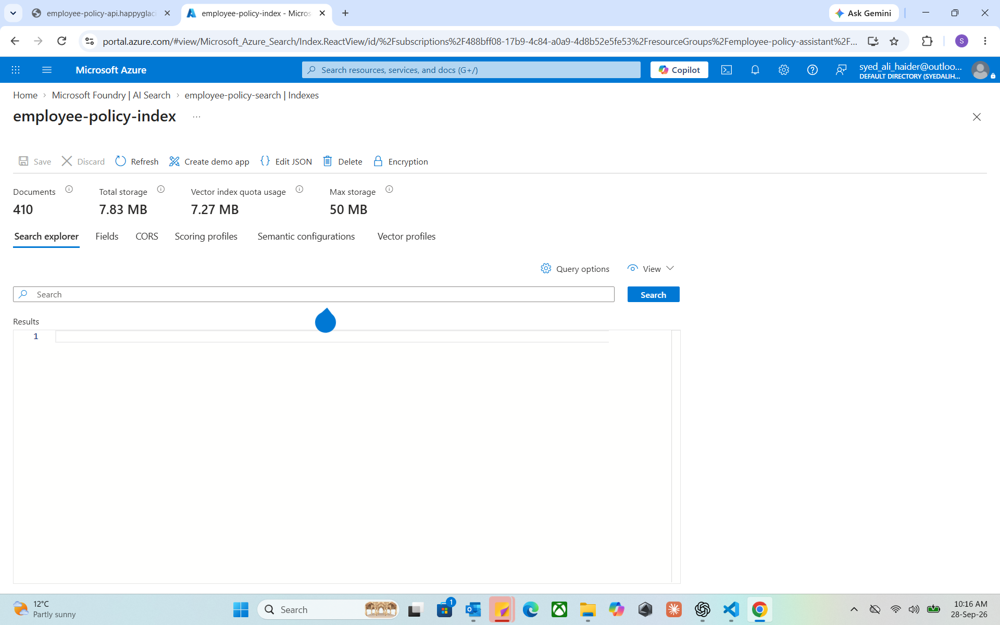
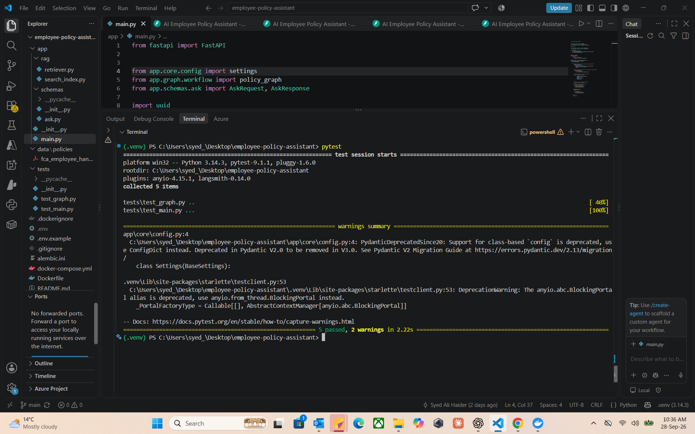

# AI Employee Policy Assistant

I built this project to get hands-on experience with LangChain, LangGraph, PostgreSQL and Docker.

It's a RAG application that answers employee policy questions from an actual policy document and shows which pages each answer came from. For the demo I'm using the publicly available FCA Employee Handbook. It runs as a FastAPI service on Azure Container Apps, with Azure OpenAI for the models and Azure AI Search for retrieval.

**Try it live:** [employee-policy-api.ambitiousgrass-686b2448.uksouth.azurecontainerapps.io/ui/](https://employee-policy-api.ambitiousgrass-686b2448.uksouth.azurecontainerapps.io/ui/)

The app scales to zero when nobody is using it, so the first load after a quiet spell takes about 20 seconds.

Built with **Python, FastAPI, LangChain, LangGraph, Azure OpenAI, Azure AI Search, PostgreSQL, SQLAlchemy, Alembic, Gradio, Docker, pytest, and Azure Container Apps**.

---

## 🎥 Project Demo

[▶️ Watch the 3-minute AI Employee Policy Assistant Demo](https://www.loom.com/share/b6b551c614f143198fc6277c381a2c57)

The demo shows the production application running on Azure, including the FastAPI API, LangGraph routing, RAG-based policy answers with source attribution, Azure AI Search vector retrieval, Azure OpenAI deployments, and automated testing.

## Architecture

```text
                              User
                                │
                                ▼
                     Azure Container Apps
                                │
                                ▼
                            FastAPI
                                │
                                ▼
                           PostgreSQL
                        Exact-match cache
                                │
                                ▼
                           LangGraph
                                │
                    Classify & Route Question
                                │
             ┌──────────────────┼──────────────────┐
             │                  │                  │
             ▼                  ▼                  ▼
       Policy Question    General Question     Out of Scope
             │                  │                  │
             ▼                  │                  │
      Azure OpenAI              │                  │
       Embeddings               │                  │
             │                  │                  │
             ▼                  │                  │
      Azure AI Search           │                  │
      Vector Retrieval          │                  │
             │                  │                  │
             ▼                  ▼                  ▼
      Retrieved Context     GPT-4o Answer      Safe Response
             │
             ▼
      Azure OpenAI GPT-4o
             │
             ▼
       Grounded Answer
             │
             ▼
       LangGraph Review
             │
             ▼
         API Response
             │
             ▼
        PostgreSQL
       Persistence
```

---

## 📸 Application Screenshots

### Production FastAPI API

The application is deployed to Azure Container Apps and exposed through a FastAPI REST API with automatically generated Swagger documentation.



### Grounded RAG Responses

Policy questions are answered using retrieved context from the FCA Employee Handbook. The API returns the generated answer together with the source document and page numbers.



### LangGraph Routing and Scope Control

LangGraph classifies incoming requests and routes them through different workflow branches. Requests outside the employee-policy scope receive a controlled response rather than being passed through the policy RAG pipeline.



### Azure AI Search Vector Index

The FCA Employee Handbook was split into 410 chunks, embedded using Azure OpenAI `text-embedding-3-small`, and indexed in Azure AI Search for vector retrieval.



### Automated Testing

The project includes pytest coverage for API behaviour and LangGraph workflow logic.



---

## How It Works

1. A user sends an employee policy question to the FastAPI `/ask` endpoint.
2. The application checks PostgreSQL for a previously stored answer to the exact question.
3. If no cached answer exists, the request enters the LangGraph workflow.
4. LangGraph classifies the question as a policy question, general question, or out-of-scope request.
5. Policy questions are routed through the RAG pipeline.
6. Azure OpenAI converts the question into a vector embedding.
7. Azure AI Search performs vector similarity search against indexed employee-policy document chunks.
8. The most relevant chunks are assembled into context for the LLM.
9. Azure OpenAI GPT-4o generates an answer using the retrieved context.
10. LangGraph performs an additional review step before returning the policy answer.
11. The question and final answer are persisted in PostgreSQL.
12. FastAPI returns the answer together with available source information.

---

## LangGraph Workflow

```text
START
  │
  ▼
Classify Question
  │
  ├── Policy Question
  │       │
  │       ▼
  │   Retrieve Policy Context
  │       │
  │       ▼
  │   Generate RAG Answer
  │       │
  │       ▼
  │   Review Answer
  │       │
  │       ├── Approved ─────────────► END
  │       │
  │       └── Rejected
  │              │
  │              ▼
  │       Safe Rejection Response
  │              │
  │              ▼
  │             END
  │
  ├── General Question
  │       │
  │       ▼
  │   Generate Answer
  │       │
  │       ▼
  │      END
  │
  └── Out of Scope
          │
          ▼
      Safe Response
          │
          ▼
         END
```

LangGraph is used as the workflow orchestration layer rather than treating the application as a single LLM call. This makes the routing and processing stages explicit and allows different types of questions to follow different execution paths.

---

## RAG Pipeline

The policy-question workflow uses Retrieval-Augmented Generation to ground answers in source documentation.

### 1. Document Loading

Policy documents are loaded from PDF files using LangChain document loaders.

### 2. Chunking

Documents are split using `RecursiveCharacterTextSplitter`.

Current configuration:

```text
Chunk size:    1000 characters
Chunk overlap: 200 characters
```

The demonstration FCA Employee Handbook contains approximately:

```text
95 PDF pages
410 text chunks
```

### 3. Embeddings

Each chunk is converted into a **1536-dimensional vector embedding** using:

```text
Azure OpenAI
text-embedding-3-small
```

### 4. Vector Index

The chunks and embeddings are stored in an Azure AI Search index containing fields such as:

```text
id
content
source
page
content_vector
```

The vector field uses an HNSW-based vector search configuration.

### 5. Retrieval

When a policy question is received:

```text
Question
   ↓
Azure OpenAI Embedding
   ↓
Vectorized Query
   ↓
Azure AI Search
   ↓
Top Relevant Policy Chunks
```

The application currently retrieves the top relevant chunks for use as LLM context.

### 6. Grounded Generation

The retrieved policy content is passed to Azure OpenAI GPT-4o with instructions to answer using the supplied context.

Source document and page information are returned where available.

---

## Example

### Request

```http
POST /ask
Content-Type: application/json
```

```json
{
  "question": "What is the annual leave policy?"
}
```

### Example Response

```json
{
  "answer": "According to the FCA Employee Handbook...",
  "sources": [
    {
      "document": "FCA Employee Handbook",
      "page": 68
    }
  ]
}
```

The exact generated answer may vary depending on the retrieved context and model output.

---

## API

### Health Check

```http
GET /health
```

Example:

```json
{
  "status": "healthy",
  "environment": "production"
}
```

### Ask a Question

```http
POST /ask
```

Request:

```json
{
  "question": "What is the annual leave policy?"
}
```

Response structure:

```json
{
  "answer": "Generated answer",
  "sources": [
    {
      "document": "Source document",
      "page": 1
    }
  ]
}
```

Interactive API documentation is available locally through FastAPI Swagger UI:

```text
http://localhost:8000/docs
```

---

## PostgreSQL Persistence

PostgreSQL is used to persist conversation information.

The `conversations` table stores:

```text
id
session_id
question
answer
sources
cache_version
created_at
```

SQLAlchemy provides the application's database abstraction layer.

### Exact-Match Cache

Before invoking the AI workflow, `/ask` checks PostgreSQL for an existing identical question.

```text
Incoming Question
       │
       ▼
PostgreSQL Lookup
       │
   ┌───┴───┐
   │       │
 Found   Not Found
   │       │
   ▼       ▼
Return    Run AI
Cached    Workflow
Answer
```

This avoids unnecessary LLM calls for identical previously answered questions.

The cache stores each answer with its sources, so cached responses keep their page references. Questions are matched after trimming and collapsing whitespace (case is kept), together with a cache version that is raised after any prompt, model or index change so older answers are ignored.

---

## Database Migrations

Database schema changes are managed using **Alembic**.

SQLAlchemy defines the application's models, while Alembic provides version-controlled database migrations.

Example:

```bash
alembic upgrade head
```

This approach allows the same database schema to be reproduced across local and cloud environments.

---

## Docker

The API is containerised using Docker.

The application image is based on:

```dockerfile
python:3.12-slim
```

The container runs FastAPI using Uvicorn:

```text
uvicorn app.main:app --host 0.0.0.0 --port 8000
```

### Local Docker Architecture

Docker Compose runs:

```text
┌───────────────────────────────┐
│            Docker             │
│                               │
│   ┌───────────────┐           │
│   │ FastAPI API   │           │
│   │ Port 8000     │           │
│   └───────┬───────┘           │
│           │                   │
│           ▼                   │
│   ┌───────────────┐           │
│   │ PostgreSQL 16 │           │
│   │ Port 5432     │           │
│   └───────────────┘           │
│                               │
└───────────────────────────────┘
```

PostgreSQL is mapped to host port `5433` during local development to avoid conflicts with other local services.

Start the local environment with:

```bash
docker compose up -d
```

Check running services:

```bash
docker compose ps
```

Stop the environment:

```bash
docker compose down
```

---

## Deployment

The live app runs on Azure Container Apps and is set up to cost as little as possible while idle.

| Part | Service |
|---|---|
| App | Azure Container Apps (Consumption plan): HTTPS ingress, scales from 0 to 1 replica, so it costs nothing while idle |
| Image | Public image on GitHub Container Registry, `ghcr.io/alihaider1993/employee-policy-assistant`, tagged with the commit it was built from |
| Database | Neon serverless PostgreSQL (free tier), for the answer cache and the daily question count |
| Retrieval | Azure AI Search, free tier |
| Models | Azure OpenAI: GPT-4o for answers, `text-embedding-3-small` for embeddings |

API keys and the database URL are stored as Container Apps secrets. `deploy/azure/deploy.py` creates or updates the deployment, and [`deploy/azure/DEPLOY.md`](deploy/azure/DEPLOY.md) has the details and the steps to deploy a new version.

**Demo limits.** To keep Azure OpenAI costs bounded, each visitor can ask 5 questions per minute, and the app answers at most 30 new questions per day across all visitors. Cached answers are free: they don't count towards the daily limit and are still served after it's reached.

---

## Security

The project follows several practical security practices.

### Secrets

Sensitive values are stored outside source control.

Examples include:

```text
Azure OpenAI API key
Azure OpenAI embedding key
Azure AI Search API key
PostgreSQL credentials
```

The local `.env` file is excluded through `.gitignore` and `.dockerignore`.

A `.env.example` file documents the required configuration without containing credentials.

### Azure Container Apps Secrets

Production credentials are stored as Azure Container Apps secrets and exposed to the application through secret references.

For example:

```text
DATABASE_URL → database-url secret
AZURE_OPENAI_API_KEY → openai-key secret
AZURE_OPENAI_EMBEDDING_KEY → embedding-key secret
AZURE_SEARCH_API_KEY → search-key secret
```

### Database Transport

The production PostgreSQL connection (Neon) requires SSL (`sslmode=require`).

---

## Testing

The project uses **pytest** for automated testing.

Tests cover areas including:

- FastAPI health endpoint
- API request validation
- `/ask` behaviour
- LangGraph routing
- RAG/retrieval behaviour
- database-related application behaviour

Run the tests with:

```bash
pytest
```

The current test suite passes locally.

Some tests exercise local application/database behaviour and are closer to integration tests than completely isolated unit tests.

---

## Local Setup

### 1. Clone the Repository

```bash
git clone <repository-url>
cd employee-policy-assistant
```

### 2. Create a Virtual Environment

Windows:

```powershell
py -3.12 -m venv .venv
.venv\Scripts\Activate.ps1
```

### 3. Install Dependencies

```bash
pip install -r requirements.txt
```

### 4. Configure Environment Variables

Copy:

```text
.env.example
```

to:

```text
.env
```

Then provide your own Azure and database configuration.

Required configuration includes:

```text
APP_NAME
APP_VERSION
ENVIRONMENT

DATABASE_URL

AZURE_OPENAI_ENDPOINT
AZURE_OPENAI_API_KEY
AZURE_OPENAI_DEPLOYMENT

AZURE_OPENAI_EMBEDDING_ENDPOINT
AZURE_OPENAI_EMBEDDING_KEY
AZURE_OPENAI_EMBEDDING_DEPLOYMENT

AZURE_SEARCH_ENDPOINT
AZURE_SEARCH_API_KEY
AZURE_SEARCH_INDEX
```

Never commit your `.env` file.

### 5. Start PostgreSQL

Using Docker Compose:

```bash
docker compose up -d postgres
```

### 6. Apply Database Migrations

```bash
alembic upgrade head
```

### 7. Start FastAPI

```bash
uvicorn app.main:app --reload
```

Open:

```text
http://localhost:8000/docs
```

### 8. Run Tests

```bash
pytest
```

---

## Project Structure

```text
employee-policy-assistant/
│
├── app/
│   ├── ai/
│   │   └── client.py
│   │
│   ├── core/
│   │   └── config.py
│   │
│   ├── database/
│   │   └── connection.py
│   │
│   ├── graph/
│   │   ├── nodes.py
│   │   ├── state.py
│   │   └── workflow.py
│   │
│   ├── models/
│   │   └── conversation.py
│   │
│   ├── rag/
│   │   ├── ...
│   │
│   ├── schemas/
│   │   └── ask.py
│   │
│   └── main.py
│
├── alembic/
│   └── versions/
│
├── data/
│   └── policies/
│
├── tests/
│
├── .dockerignore
├── .env.example
├── .gitignore
├── alembic.ini
├── docker-compose.yml
├── Dockerfile
├── requirements.txt
└── README.md
```

---

## Technology Stack

### Application

- Python
- FastAPI
- Pydantic

### AI & Orchestration

- LangChain
- LangGraph
- Azure OpenAI
- GPT-4o
- text-embedding-3-small

### Retrieval

- Azure AI Search
- Vector search
- HNSW
- RAG

### Database

- PostgreSQL
- SQLAlchemy
- Alembic
- psycopg

### Testing

- pytest
- HTTPX

### DevOps & Cloud

- Docker
- Docker Compose
- Azure Container Apps
- GitHub Container Registry
- Neon serverless PostgreSQL

---

## Engineering Concepts Demonstrated

This project was designed to demonstrate practical AI engineering beyond simply calling an LLM API.

It includes:

- REST API development with FastAPI
- Request/response validation with Pydantic
- Stateful AI workflow orchestration with LangGraph
- Retrieval-Augmented Generation
- document chunking and embeddings
- vector similarity search
- grounded LLM generation
- source attribution
- relational persistence
- database-backed exact-match caching
- SQLAlchemy ORM
- version-controlled database migrations
- automated testing
- Docker containerisation
- multi-container local development
- cloud container deployment
- production environment configuration
- secret management
- cloud logging and diagnostics

---

## Design Decisions

### Why LangGraph?

The application contains multiple execution paths rather than a single prompt-response interaction.

LangGraph provides explicit control over:

- question classification
- conditional routing
- policy RAG execution
- general-question handling
- out-of-scope handling
- answer review
- rejection handling

This makes the AI workflow easier to inspect and extend than embedding all decision logic inside one prompt.

### Why Azure AI Search?

Azure AI Search provides managed vector indexing and retrieval and integrates naturally with Azure OpenAI-based applications.

### Why PostgreSQL?

PostgreSQL provides durable application persistence and allows the project to demonstrate relational database integration alongside the AI components.

### Why FastAPI?

FastAPI provides a lightweight API layer with Pydantic validation and automatically generated OpenAPI/Swagger documentation.

### Why Docker?

Docker creates a reproducible application runtime across local development and cloud deployment.

---

## Current Limitations

This is a portfolio and learning project rather than a production HR system.

Current limitations include:

- The knowledge base uses a limited demonstration policy dataset.
- Exact-match caching does not perform semantic cache matching.
- The application does not currently implement end-user authentication or authorisation.
- The answer-review stage evaluates the generated response but does not independently re-retrieve the original policy context.
- Policy content must be re-indexed when the underlying source documentation changes.

These are deliberate scope boundaries rather than claims of full enterprise production readiness.

---

## Policy Dataset & Disclaimer

This project uses the **FCA Employee Handbook** as a public policy document for demonstrating the RAG architecture.

The handbook is used as a technical demonstration dataset only.

**This project is independent and is not affiliated with, sponsored by, or endorsed by the Financial Conduct Authority (FCA).**

Answers generated by the application should not be interpreted as universal UK employment policy or legal advice. Employment policies can vary between organisations, contracts, roles, and jurisdictions.

For real organisational use, the RAG knowledge base should be populated with the organisation's own approved and current policy documentation.

---

## Future Improvements

Potential future extensions include:

- authentication and role-based access control
- semantic caching
- document upload and automated indexing
- stronger retrieval evaluation
- hybrid keyword/vector search
- improved answer-review grounding
- structured observability and tracing
- CI/CD pipeline
- private networking for Azure resources

These features are intentionally outside the current portfolio scope.

---

## Status

**Core application complete and successfully deployed to Azure.**

Validated end-to-end flow:

```text
Azure Container Apps
        ↓
FastAPI
        ↓
PostgreSQL Cache
        ↓
LangGraph
        ↓
Azure OpenAI Embeddings
        ↓
Azure AI Search
        ↓
Azure OpenAI GPT-4o
        ↓
Grounded Policy Answer
        ↓
PostgreSQL Persistence
```

---

## Author

**Syed Ali Haider**
GitHub: `alihaider1993`
